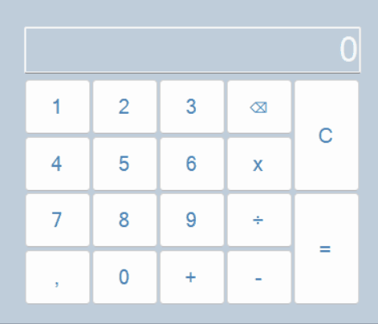

# Calculator

Aplikasi desktop sederhana yang menggunakan .NET framework. 

Aplikasi ini  dapat digunakan dengan mudah, hanya dengan menginput angka lalu menginput operator yang ingin digunakan untuk menghitung hasilnya dengan angka kedua yang diinput, setelah itu kalkulator tersebut akan memberikan hasil dari perhitungan angka yang sudah diinput.

**Demo :**

